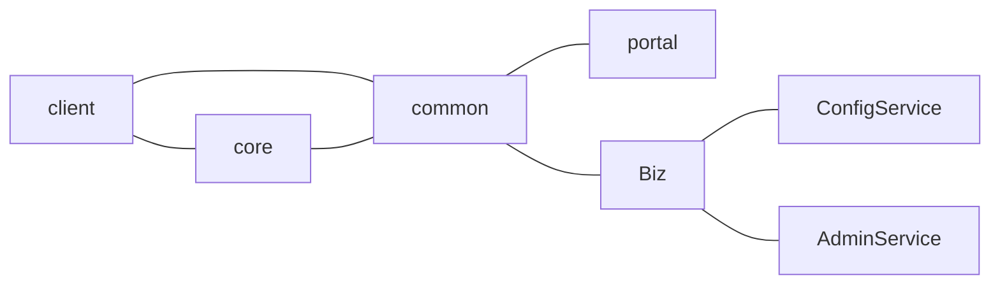

BOM 即浏览器对象模型，是与浏览器交换的方法和接口。它提供了可以与浏览器窗口进行交互的对象结构，BOM 由多个对象构成，其中代表浏览器窗口的 window 对象是 OBM 的顶层对象。


## window 对象

BOM 的核心对象是 window,它表示浏览器的一个实例。在浏览器中，window 对象有双重角色。

- 1. 是 JavaScript 访问浏览器窗口的一个接口
- 2. 也是 ECMAScript 规定的 Global 对象。即在网页中定义的所有的全局对象，全局函数，全局变量都是自动成为 window 对象的成员，甚至是 DOM 对象也是 window 的属性。`window.document.getElementById("id")`等同于`document.getElementById("id")`

#### 窗口关系及框架

- 如果页面中包含框架（frame/iframe 标签），则每个框架都有自己的 window 对象，并保存在 frames 集合中
- `top`对象始终指向最高层的框架，也就是浏览器窗口。
- `self`对象，始终指向 window。

#### 窗口大小

- `outerWidth`,`outerHeight`，返回浏览器窗口本身大小
- `innerWidth`,`innerHeight`，返回页面视口大小
- 如果是移动浏览器，都返回的是布局视口，即渲染后页面的实际大小（与可见视口不同，可见视口只是整个页面的一小部分）
- `document.documentElement.clientWidth`和`document.documentElement.clientHeight`也保存了页面视口信息，返回页面视口大小


#### 导航、打开窗口

- 在 HTML 中，可以使用一个 a 标签
  ```HTML
  <a href="foo.html" target="windowName">about foos</a>
  ```
- 在 JavaScript，使用`window.open()`方法既可以导航到一个特定的 URL，也可以打开一个新的浏览器窗口。
  ```JavaScript
  window.open("foo.html", "windowName")
  ```
  上述 2 方法，如果已经参加名称为"windowName"的窗口或框架，就会在其中加载指定的 URL。否则，就会穿甲一个新窗口并将其命名为"windowName"

窗口的名称必须是单个单词(只能是字母、数字和下划线，不能以数字开头)。有 4 个预定义的`target`:

| \_blank  | 总是打开一个新窗口                         |
| -------- | ------------------------------------------ |
| \_self   | 总是在当前窗口或框架中打开                 |
| \_parent | 在父框架中打开（如果有的话），否则为\_self |
| \_top    | 打开整个浏览器窗口，即使有框架             |

`window.open()`可接受 4 个参数：

- 1. 要加载的 URL
- 2. 窗口目标（target）
- 3. 新窗口的特性（字符串形式，以逗号分隔），控制新窗口的样式
- 4. 新页面是否取代浏览器历史记录中当前加载页面 （布尔值）

#### 窗口特性的设置选项


```HTML
  <body>
    <button id="but">Open new Window</button>
    <!-- <button id="close">close</button> -->
    <script>
      if (window.name == "myWindow") {
        // Opened by myself
        document.write('<div class="example">\n');
        document.write(
          '<input type="button" onclick="window.close()"' +
            ' value="window.close()"><\/div>\n'
        );
      }
      var but = document.getElementById("but");
      but.onclick = function() {
        let randowTop = Math.floor(Math.random() * 500 + 2);
        var newWindow = window.open(
          location.href,
          "myWindow",
          `height=300,width=300,left=100,top=${randowTop},menubar=no,status=no`
        );
      };
    </script>
  </body>
```

**[参考文章: windowd 对象](http://www.infimum.dk/HTML/JSwindows.html)**

## location 对象

location 对象提供了电器窗口中加载是文档有关的信息，以及一些导航功能。它既是 window 对象的属性，又是 document 对象的属性。

| 属性名   | 例子                     | 说明                                           |
| -------- | ------------------------ | ---------------------------------------------- |
| hash     | "#contents"              | URL 中 的 hash（#后跟的字符）                  |
| host     | "www.baidu.com:80"       | 服务器名称和端口（如果有）                     |
| hostname | "www.baidu.com"          | 服务器名称，不带端口                           |
| href     | "https://www.baidu.com/" | 当前加载页面的完整 URL，toString()返回值       |
| pathname | "/zh-CN/"                | URL 中的目录和文件名                           |
| port     | "8080"                   | URL 中指定的端口号，如果不包含，则返回空字符串 |
| protocol | "https:"                 | 页面使用的协议                                 |
| search   | "?q=java"                | URL 的查询字符串，以问号开头                   |

#### location 修改操作

修改`location`对象的属性可以改变当前加载的页面，除 hansh 外，每次修改`location`对象的属性，页面都会以新的 URL 重新加载，并且浏览器的历史记录中也会生成一条新记录。  
`reload()`方法，重新加载当前显示页面。如果 不传递 参数，页面会以最有效的方式重新加载。如果传递参数 true,则是要强制从服务器重新加载。`location.reload(true)`

## navigator 对象

navigator 对象包含有关浏览器的信息。主要属性及说明如下表：

| Property      | Description                      |
| ------------- | -------------------------------- |
| appCodeName   | 浏览器名称 通常是"Mozilla"       |
| appName       | 完整的浏览器名称                 |
| appVersion    | 浏览器版本                       |
| cookieEnabled | cookie 是否启用                  |
| geolocation   | 可用于定位用户位置的地理地位对象 |
| language      | 浏览器的主语言                   |
| onLine        | 浏览器是否联网                   |
| platform      | 浏览器所在的系统平台             |
| product       | 产品名称                         |
| userAgent     | 发送给服务器的用户代理头信息     |


## history 对象

history 对象保存着用户上网的历史记录，从窗口被打开那一刻算起。因为 history 是 window 对象的属性，所以每个浏览器窗口，每个标签页，每个框架，都有自己的 history 对象。

#### history 对象 属性

- `length`属性，保存着历史记录的数量

#### history 对象 方法

- `back()`,在 history 中向后跳转，等同于 点击浏览器回退按钮
- `forward()`，在 history 中向前跳转，等同于 点击浏览器前进按钮
- `go()`，跳转到 history 中指定的一个页面，通过与当前页面相对位置来标志
- `pushState()`,添加历史记录条目，调用后，浏览器不会立即加载该 URL，某种意义上，同`window.location="#foo"`类似。需要三个参数，状态对象，标题，TURL。
  - 状态对象，是一个 JavaScript 对象。无论什么时候用户导航到新的状态，popstate 事件就会触发，
  - 标题，字符串形式
  - URL，定义了新的历史 URL 记录。
- `repalceState()`，修改当前历史记录项，比如想要更新状态对象 state,或者带当前历史记录的 URL

> 因公

> [success] dd


