## 概述

**Markdown**是由**Daring Fireball**创造，这是其原始的 [指南](https://daringfireball.net/)，但它的语法在不同的解析器喝编辑器之间是不同的。**Typora**试图去跟随[ [GitHub Flavored Markdown](https://help.github.com/articles/github-flavored-markdown/)，但仍然有些小的不兼容。

## 块级元素

###  段落和换行

段落是一个或多个连续的文本行。在markdown源码中，段落由两个或多个空行分隔。但是,在Typora中，只需要一行空白（按回车一次）就可以创建一个新的段落。  

按 **Shift + Return ** 可以创建单个换行符。**大多数的markdown解析器会忽略单个换行符**，因此，为了让其他markdown解析器也能识别换行符，需要在行尾留下两个空格，或者插入`<br>`      

### 标题  Header

在一行的开始使用1-6个`#`字符，对应标题的1-6级。快捷键 : `Ctrl 1` - `Ctrl 6`

```
# H1
## H2
###### H6
```

### 引用块  Block quote

使用`>`字符后跟所要引用的内容。添加不同级别的`>`可实现嵌套的引用块

```
> blockquote 1  
>
> blockqoute 1


> anthoer blockqoute 2
```

> block quote 1	
>
> >nested block quote 3
> >
> >nested block quote 3   
>
> block quote 1

> block quote 2

### 列表  List

`*`：无序列表，`1.`：有序列表

```
无效列表
* Red
* Green
* Blue
有序列表
1. Red
2. Green
3. Blue
```

* Red
* Green
* Blue

1. Red
2. Green
3. Blue

### 任务列表  Task  List

`[ ]`：未完成, `[x]`：已完成

```
- [ ] task list item
- [ ] incomplete
- [x] completed
```

- [ ] task list item
- [x] incomplete
- [x] completed
- [x] completed

### 代码块 Code Block

键入` ``` + type ` + 回车，创建带语言高亮的代码块

```
an example
​```
function test() {
consle.log('jiang')
}
​```
语法高亮
​```js
function test() {
consle.log('jiang')
}
​```
```

```` + 回车`，语法不会高亮

```
function test() {
consle.log('jiang')
}	
```

````js + 回车 `，语法会高亮显示

```js
function test() {
consle.log('jiang')
}
```

### 数学公式  

Typora 支持使用 **Tex/LaTeX**语法来呈现数学公式，该渲呈现过程是由[MathJax](https://www.mathjax.org/)处理

#### 参考

[数学公式- 在线编辑器](http://latex.codecogs.com/eqneditor/editor.php)

[在MathJax中可用的Tex命令](http://www.onemathematicalcat.org/MathJaxDocumentation/TeXSyntax.htm)

#### 块间数学公式 Math Block

公式分隔符：`$$...$$`

```latex
$$
\begin{align*} 
y = y(x,t) &= A e^{i\theta} \\ 
&= A (\cos \theta + i \sin \theta) \\
&= A (\cos(kx - \omega t) + i \sin(kx - \omega t)) \\
&= A\cos \Big(\frac{2\pi}{\lambda}x - \frac{2\pi v}{\lambda}t\Big)
\end{align*}
$$
```

$$
\begin{align*} 
y = y(x,t) &= A e^{i\theta} \\ 
&= A (\cos \theta + i \sin \theta) \\
&= A (\cos(kx - \omega t) + i \sin(kx - \omega t)) \\
&= A\cos \Big(\frac{2\pi}{\lambda}x - \frac{2\pi v}{\lambda}t\Big)
\end{align*}
$$

#### 行内数学公式 Inline Math

默认公式分隔符：`\(...\)`，或者在Typora偏好设置->Markdown，勾选I`nline Math`,就可以使用`$...$`分隔符


行内公式1：$\frac{2\pi}{T}$

#### 化学式  Chemistry Expressions

公式分隔符：`$\ce{...}$`

例如`$\ce{CO2 + C -> 2 CO} $`:   $ \ce{co2 + c -> 2 co} $，`$\ce{H20} $`: $\ce{H2O}$


### 表格  Table

键入`|First Header|Second Header|` 然后按回车键，创建一个2列的表格

通过在标题行中包含的冒号`(:)`，可以设置该列的文本对齐方式 

```
| Left-Aligned  | Center Aligned  | Right Aligned |
| :------------ |:---------------:| -----:|
| col 3 is      | some wordy text | $1600 |
| col 2 is      | centered        |   $12 |
| zebra stripes | are neat        |    $1 |
```

| Left-Aligned  | Center Aligned  | Right Aligned |
| :------------ | :-------------: | ------------: |
| col 3 is      | some wordy text |         $1600 |
| col 2 is      |    centered     |           $12 |
| zebra stripes |    are neat     |            $1 |

### 脚注 Footnote

使用`[^fn1]`来创建引用脚注标识，使用`[^fn1]:脚注内容`来创建脚注内容

```
You can create footnotes like this[^fn1] and this[^fn2].

[^fn1]: Here is the *text* of the first **footnote**.
[^fn2]: Here is the *text* of the second **footnote**.
```

脚注1[^1] ，脚注2[^2]

[^1]: 脚注1
[^2]: 脚注2 

### 水平线  Horizontal  Line

使用`***`或者`---`来画一条水平线

***

---

***

---


### 目录   Table Of Contents （TOC）

键入`[toc]`然后按回车键，创建文档的目录部分,TOC从文档中提取所有的标题，并且其内容会自动更新

[toc]


## 行内元素

### 链接 Link

Markdown支持3种链接样式

- 行内链接 Inline Link

  ```
  This is [baidu](http://baidu.com "百度") inline link
  This is [刘振江-个人博客](https://aixuexi567.github.io/) has no title attribut. 
  ```

  This is [baidu](http://baidu.com "百度") inline link
  This is [刘振江-个人博客](https://aixuexi567.github.io/) has no title attribut. 

- 内部链接 Internal Link

  使用header元素的名称作为href，可创建一个类似“书签”的内部链接，并在单击后跳转到该部分

  ```markdown
  Hold down Ctrl and click on [引用块 Block quote](#引用块  Block quote) to jump to header `引用块 Block quote`
  ```

  Hold down Ctrl and click on [引用块 Block quote](#引用块  Block quote) to jump to header `引用块 Block quote`

  

- 引用链接 Reference Link

  ```markdown
  This is [刘振江-个人博客][lzj-blog] reference-style link.
  
  Then, anywhere in the document,you define your link label on a line by  itself like this:	
  [lzj-blog]: https://aixuexi567.github.io/ "刘振江-个人博客，关于技术总结，工作心得，随便感悟"
  ```

  This is [刘振江-个人博客][lzj-blog] reference-style link.

  Then, anywhere in the document,you define your link label on a line by  itself like this:	

  [lzj-blog]: https://aixuexi567.github.io "随笔感悟，工作心得，技术总结"


### URLs

Typora允许用链接的形式插入url，并用`<>`包装。例如 `<betterjiangjiang@gmail.com>`将成为<betterjiangjiang@gmail.com>   <www.baidu.com>

Typora 还会自动链接那些没有尖括号包装的准url,（例如： www.gogle.com）

### 图片   /Image

```


```


### 强调/加重  Emphasis

使用一个星号`（*）`或者下划线`(_)`包装需要强调的文本，同HTML种`<em>`标签

```
*Single asterisks*
_single underscores_
```

Empjasis *Single asterisks*
Empjasis _Sngle underscores_

### 加粗  Strong

两个星号`（*）`或者下划线`(_)`会使其包含的内容被HTML`<strong>`标签包装

```
**double asterisks**
__double underscores__
```

produces: **double asteriks**       __double underscores__

### 代码  Code

使用反引号`` (`)``,(使用了双反引号来显示反引号)，来在行内插入代码

```
Use the `Printf()` function.
```

Use the `Printf()` function.

### 删除线  Strikethrough

使用双波浪线`~~`包裹内容。`~~Mistaken text~~` ，变成 ~~Mistaken text~~

### 表情符号   Emoji

```
:smile: smile emoji
:cry: sad emoji
:laughing: laughing 
```

:smile: smile emoji

:cry: cry emoji

:laughing: laughing emoji

### 行内数学公式    Inline Math

使用`$`包裹 **LaText**命令。例如` $\lim_{x \to \infty} \exp(-x) = 0$`,即   $\lim_{x \to \infty} \exp(-x) = 0$

### 上/下脚标、高亮  Subscript/SuperScript、Highlight

要使用该功能，**Typora首先要在偏好设置的Markdown选项中启用它们**

- 使用`~`包裹下标内容，例如 `H~2~O`,H~2~O
- 使用`^`包裹上标内容，例如 `X^2^`,X^2^
- 使用`==`包括高亮内容，例如 `==highlight==`，==hightlight==       

### HTML

可以使用HTML来设计纯Markdown不支持的样式内容。例如 使用`<span style="color:red">this text is red</span>`添加红色文本

如果明天，我依然 <span style="color:red">爱 😔</span>你！

### 下划线  Underline

Markdown中没有指定下划线，但是支持属于HTML中的下划线标签`<u>`

`<u>Underline</u>`，<u>Underline</u>

### 嵌入内容   Embed  Content

有一些网站提供了基于iframe的嵌入代码，可将其粘贴到Typora中。

```html
<iframe height='265' scrolling='no' title='Fancy Animated SVG Menu' src='http://codepen.io/jeangontijo/embed/OxVywj/?height=265&theme-id=0&default-tab=css,result&embed-version=2' frameborder='no' allowtransparency='true' allowfullscreen='true' style='width: 100%;'></iframe>
```

<iframe height='265' scrolling='no' title='Fancy Animated SVG Menu' src='http://codepen.io/jeangontijo/embed/OxVywj/?height=265&theme-id=0&default-tab=css,result&embed-version=2' frameborder='no' allowtransparency='true' allowfullscreen='true' style='width: 100%;'></iframe>

<iframe height="565" style="width: 100%;" scrolling="no" title="Solution 10 - Intro to Vue" src="https://codepen.io/aixuexi567/embed/yLYNyJL?height=265&theme-id=light&default-tab=js,result" frameborder="no" allowtransparency="true" allowfullscreen="true">
  See the Pen <a href='https://codepen.io/aixuexi567/pen/yLYNyJL'>Solution 10 - Intro to Vue</a> by 江
  (<a href='https://codepen.io/aixuexi567'>@aixuexi567</a>) on <a href='https://codepen.io'>CodePen</a>.
</iframe>

<iframe width="560" height="315" src="https://www.youtube.com/embed/F9QeZOGdRdE?start=130" frameborder="0" allow="accelerometer; autoplay; encrypted-media; gyroscope; picture-in-picture" allowfullscreen></iframe>


## 画图 Draw Diagram

Typora在从偏好设置中启用后，会支持一些图表的Markdown扩展。此外，你应该注意到图表是不受标准Markdown、CmmonMark或GFM支持的。因此，建议插入图表的图片，而不是直接在Markdown中写它们。

### 时序/序列图  Sequence Diagram

该特性使用[js-sequence](https://bramp.github.io/js-sequence-diagrams/),它将下面的代码块转化为一个时序图

```
Alice->Bob: Hello Bob, how are you ?
Note right of Bob: Bob Thinks
Bob-->Alice: I am good thanks!
```


```sequence
Alice->Bob: Hello Bob, how are you ?
Note right of Bob: Bob Thinks
Bob-->Alice: I am good thanks!
```

#### 语法

下图显示了*js-sequence*绘制时序图的语法


#### 用法

js-sequence-diagrams依赖 [Snap.svg](http://http//snapsvg.io/)和 [Underscore.js](http://underscorejs.org/)（或者 [lodash](http://lodash.com/)）

```html
<script src="webfont.js"></script>
<script src="snap.svg-min.js"></script>
<script src="underscore-min.js"></script>
<script src="sequence-diagram-min.js"></script>
```

```js
<div id="diagram"></div>
<script>
  var diagram = Diagram.parse("A->B: Message");
  diagram.drawSVG("diagram", {theme: 'hand'});
</script>
```

### 流程图   Flowchart

该特性使用[flowchart.js](http://flowchart.js.org/),它将下面代码块转化成一个流程图

```
st=>start: Start
op=>operation: Your Operation
cond=>condition: Yes or No?
e=>end

st->op->cond
cond(yes)->e
cond(no)->op
```


```flow
st=>start: Start
op=>operation: Your Operation
cond=>condition: Yes or No?
e=>end

st->op->cond
cond(yes)->e
cond(no)->op
```


#### 一个比较复杂的demo，[locize](https://locize.com/)简单使用指南

```flow
st=>start: Imporve your
110n process!
e=>end: Continue to have fun! :>https://youtu.be/YQryHo1iHb8[blank]
op1=>operation: Go to locize.com :>https://locize.com[blank]
sub1=>subroutine: Read the awesomeness
cond=>condition: Interested to  getting started?
io=>inputoutput: Register :>https://www.locize.app/register[blank]
sub2=>subroutine: Read about inproving
your localization workflow
or anther source :>https://medium.com/@adrai/8-signs-you-should-improve-your-localization-process-3dc075d53998[blank]
op2=>operation: Login :>https://www.locize.app/login[blank]
cond2=>condition: Valid password?
cond3=>condition: Reset password?
op3=>operation: Send email
sub3=>subroutine: Create a demo project
sub4=>subroutine: Start your real project
io2=>inputoutput: Subscribe

st->op1->sub1->cond
cond(yes)->io->op2->cond2
cond2(no)->cond3
cond3(no,bottom)->op2
cond3(yes)->op3
op3(right)->op2
cond2(yes)->sub3
sub3->sub4->io2->e
cond(no)->sub2(right)->op1
```

### Mermaid

Tpora 还集成了[mermaid](https://mermaid-js.github.io/mermaid/#/)，它支持序列图，流程图，甘特图，类图，状态图和饼图。

```
​```mermaid
graph TB
Start --> Stop
​```
```


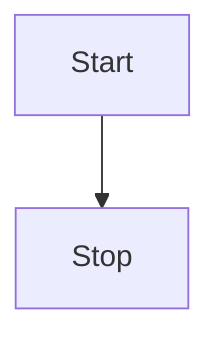


#### flowchart

##### Graph

该语句声明一个新的流程图，及其布局方向。**使用`%%`来注释** 

- TB - top bottom
- BT - bottom top
- RL - right left
- LR - left right
- TD - 同TB，top bottom

```
graph LR
Start --> Stop
```

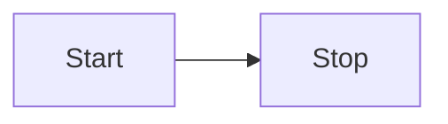

##### Nodes & shapes  节点和形状

- 节点使用`id`声明,节点框内默认显示id

```
graph LR
id
```

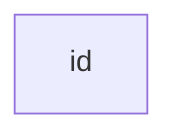

- 可在id不同的框设置文本

  ```
  graph LR
  id1[This is the text in the box]
  ```

  ```mermaid
  graph LR
  id1[This is the text in the box]
  ```

  

- 带圆角的节点

  ```
  graph LR
  id2(node with round edges)
  ```

  ```mermaid
  graph LR
  id2(node with round edges)
  ```

  - 菱形形的节点

  ```
  graph LR
  id3{"node(rhombus)"}
  ```

  ```mermaid
  graph LR
  id3{"node(rhombus)"}
  ```

  - 平行四边形

    ```
    graph LR
    id4[/Parallelogram/]
    ```

    ```mermaid
    graph LR
    id4[/"node(parallelogram)"/]
    ```


##### Links between nodes   节点之间的联系

- 带箭头的连接

  ```
  graph LR
  A --> B
  ```

  ```mermaid
  graph LR
  A --> B
  ```

- 带文本的连接

  ```
  graph LR
  A -->|text|B
  
  // or
  graph LR
  c -- text --> D
  ```

  ```mermaid
  graph LR
  A -->|text|B
  
  c -- text --> D
  ```

  - 虚线连接

    ```
    graph LR
    A -. text .-> B
    ```

    ```mermaid
    graph LR
    A -. text .-> B
    ```

  - 粗细连接

    ```
    graph  LR
    A == text ==> B
    ```

    ```mermaid
    graph  LR
    A == text ==> B
    ```

  - 节点链

    ```
    graph LR
    A --> B & C & D --> E
    ```

    ```mermaid
    graph LR
    A --> C --> D
    ```

  - 子图

    ```
    graph TB
        c1-->a2
        subgraph one
        a1-->a2
        end
        subgraph two
        b1-->b2
        end
        subgraph three
        c1-->c2
        end
    ```

    ```mermaid
    graph TB
        c1-->a2
        subgraph one
        a1-->a2
        end
        subgraph two
        b1-->b2
        end
        subgraph three
        c1-->c2
        end
    ```

    

#### Sequence diagrams

##### 语法 Syntax

- 参与者/角色（actor），可隐式/显示定义，在图中按定义顺序出现，也可指定其呈现顺序

  ```
  sequenceDiagram
  participant John 
  participant A as Alice
  
  A->>John: Hello John, how are you?
  John-->>A: Great!
  
  A->>Shery: Hello Shery ?
  ```

  ```mermaid
  sequenceDiagram
  participant John 
  participant A as Alice
  
  A->>John: Hello John, how are you?
  John-->>A: Great!
  
  A->>Shery: Hello Shery ?
  ```

##### 消息  Messages

```
[Actor][Arrow][Actor]: Message text
```

6中箭头类型

| Type |   Description    |
| :--: | :--------------: |
|  ->  |   带箭头的实线   |
| -->  |  不带箭头的虚线  |
| ->>  |   带箭头的实线   |
| -->> |  不带箭头的虚线  |
|  -x  | 末尾带叉号的实线 |
| --x  | 末尾带叉号的虚线 |

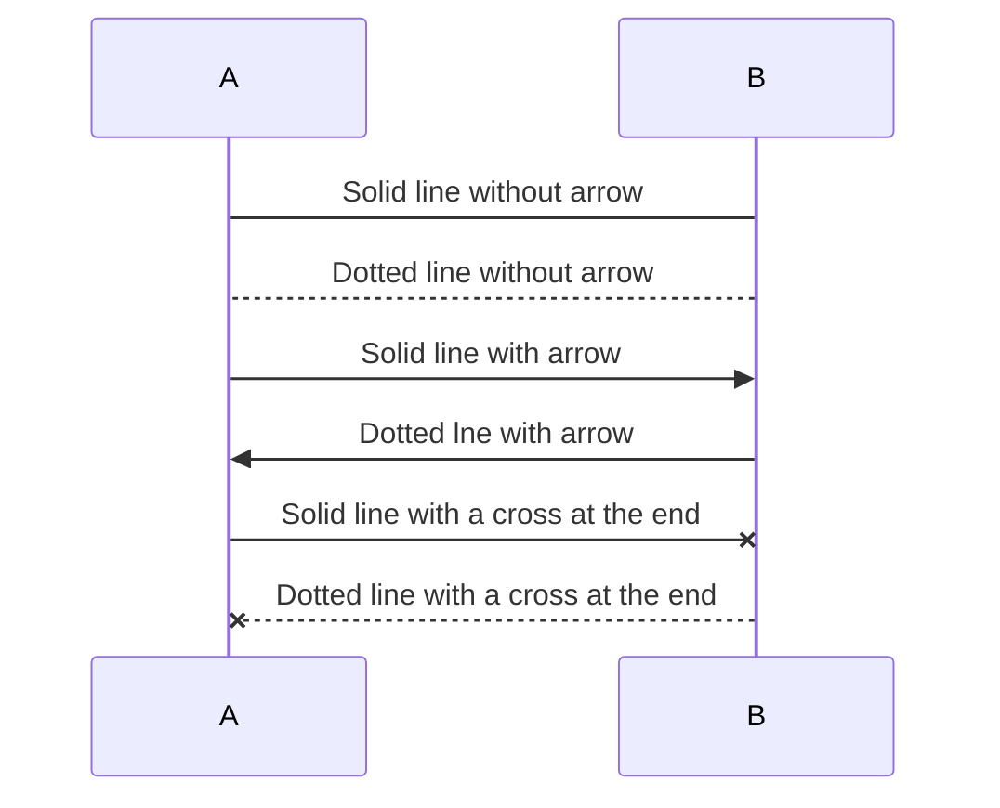

##### 激活  Activation

使用**`activate`**和**`deactive`**声明，激活或停用某个角色，快捷方法，在消息箭头添加`+`,`-`后缀。

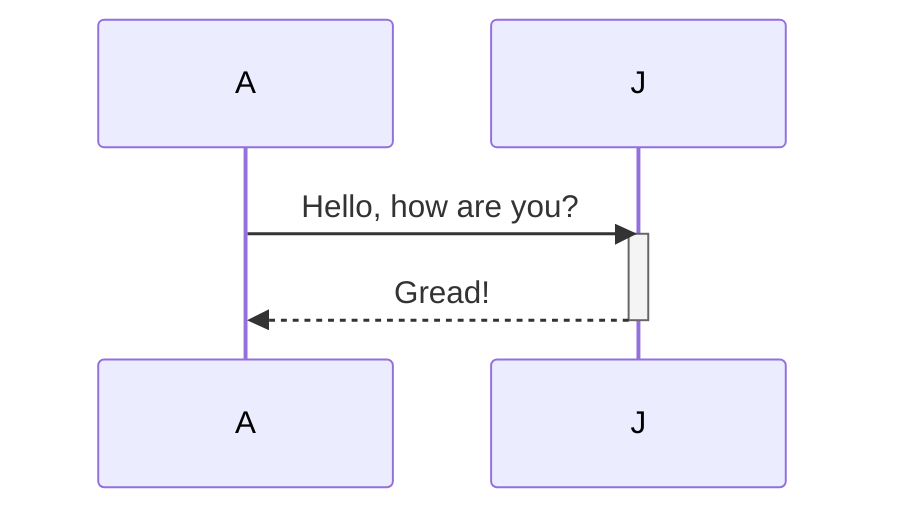

同一角色可叠加激活

```
sequenceDiagram
A->>+J: Hello John, how are you?
A->>+J: John, can you hear me?
J-->>-A: Hi Alice, I can hear you!
J-->>-A: I fell gread!
```


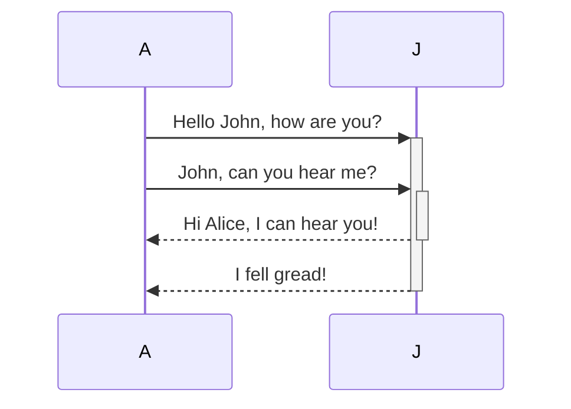

#####  注释 /说明 Notes

```
Note [right of | left of | over][Actor]: Text in note content
```

```
sequenceDiagram
participant John
Note right of John: Text in note
```

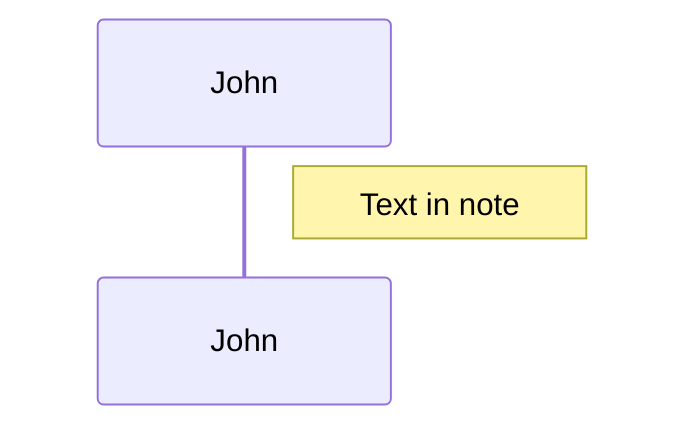

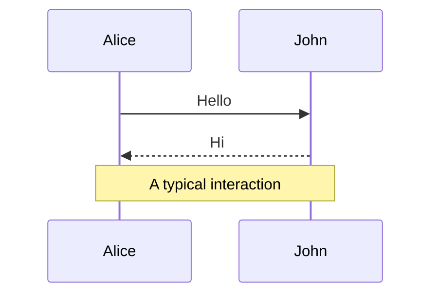

##### 循环 Loops

```
loop Loop text
... statements ...
end
```


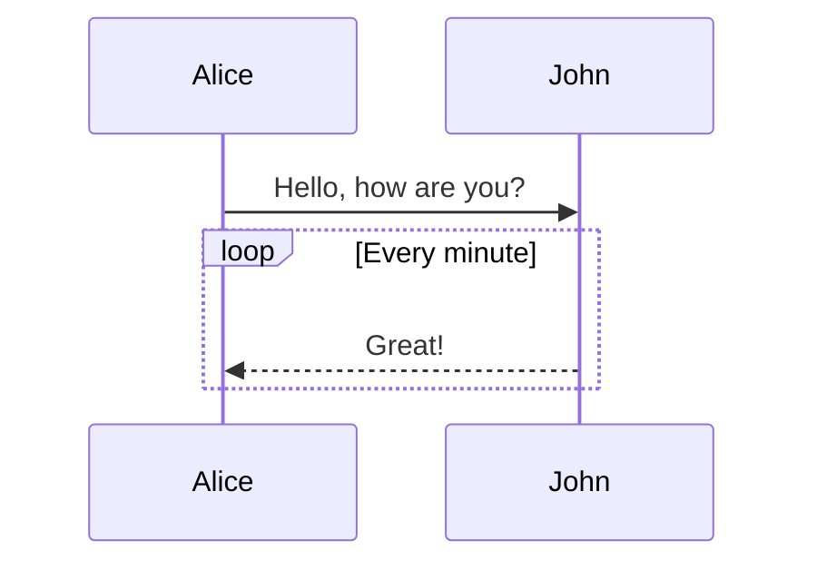

##### 选择  Alt（alternative）

- 2选1

  ```
  alt Describing text
  ... statements ...
  else
  ... statements ...
  end
  ```

  

- 可选 (可选可不选，没有第二选项)

  ```
  opt Descibing text
  ... statements ...
  end
  ```

```
sequenceDiagram
A->>B: Hello Bob, how are you?
alt is sick
	B-->>A: Not so good
else is well
	B-->A: Feeling good
end

opt Extra responese
	B-->>A: Thanks for asking
end
```

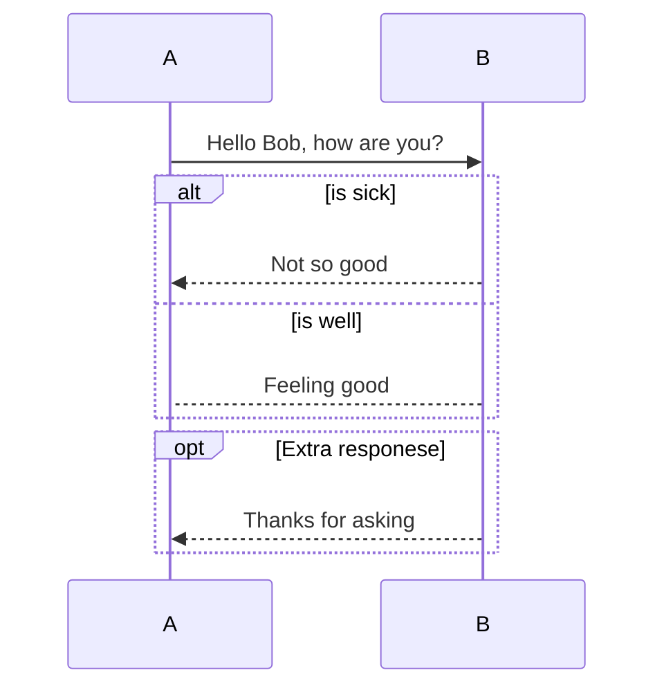

##### 并行 Parallel

显示并行发生的操作

```
par [Action 1]
... statements ...
and [Action 2]
... statements ...
and [Action N]
... statements ...
end
```

```
sequenceDiagram
par Alice to  Bob
Alice->>Bob: Hello guys!
and Alice to John
Alice->>John: Hello guys!
end
Bob-->>Alice: Hi Alice!
John-->>Alice: Hi Alice!
```

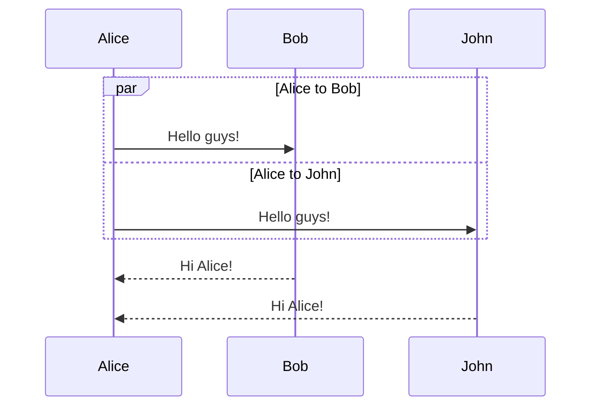

##### 背景高亮 Background Highlighting

```
rect rgb(0,125,0)
... content ...
end


rect rgba(0,123,0,0.4)
... content
end
```

```
sequenceDiagram
rect rgba(0,123,0,0.8)
    A->>B: Hello Bob, how are you?
    alt is sick
        B-->>A: Not so good
    else is well
        B-->A: Feeling good
    end

    opt Extra responese
        B-->>A: Thanks for asking
    end
end
```

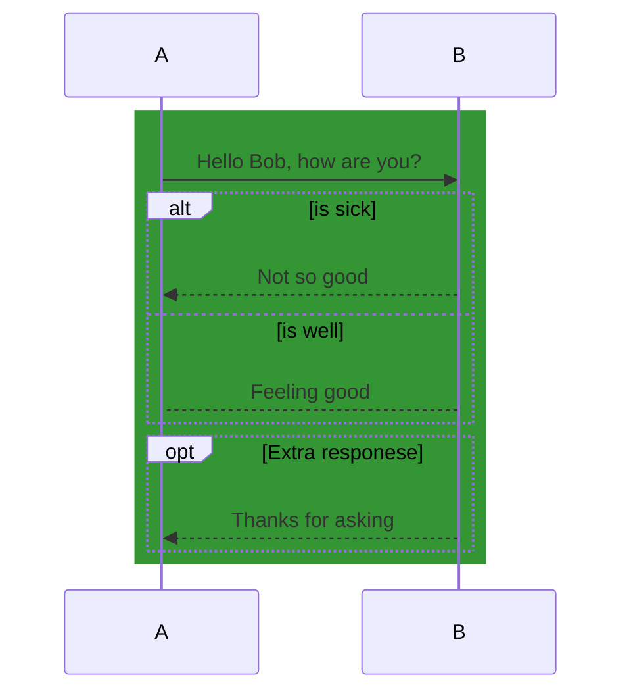

##### 序号标识   sequenceNumbers

```
sequenceDiagram
    autonumber
    Alice->>John: Hello John, how are you?
    loop Healthcheck
        John->>John: Fight against hypochondria
    end
    Note right of John: Rational thoughts!
    John-->>Alice: Great!
    John->>Bob: How about you?
    Bob-->>John: Jolly good!

```


#### Class Diagram

##### 定义类

```
classDiagram
class BankAccount {
+String owner
+BigDecimal balance

+deposit(amount)
+withdrawl(amount) 
}
```

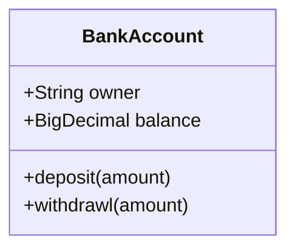

##### 可见性  Visiblity

- `+` Public
- `-` Private
- `#` Protected
- `~` Package/Internal

#####  关系  RelationShip

| Type  | Description        |
| ----- | ------------------ |
| <\|-- | Inheritance   继承 |
| ..\|> | Realization 实现   |
| ..>   | Dependency  依赖   |
| -->   | Association  关联  |
| *--   | Composition 组合   |
| o--   | Aggregation 聚合   |
| --    | Link （Solid）     |
| ..    | Link （Dashed）    |

```
classDiagram
classA <|-- classB : Inheritance,继承（一般与特殊关系），箭头指向父类
classM <|.. classN : Realization，实现，箭头指向接口
classK <.. classL : Dependency, 依赖（使用关系），箭头指向被使用者
classG <-- classH : Association，关联（拥有关系），箭头指向被拥有者
classC *-- classD : Composition，组合（整体与部分关系，部分不能离开整体而单独存在），菱形指向整体
classE o-- classF : Aggregation，聚合，（整体部分关系，但部分可以离开整体而单独存在），菱形指向整体

classI -- classJ : Link(Solid)
classO .. classP : Link(Dashed) 

class classM {
<<interface>>
}
```

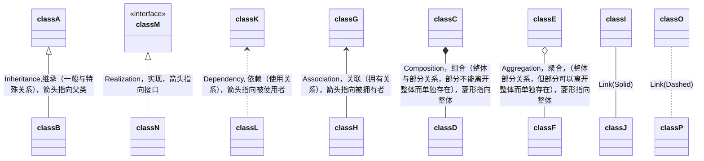

##### 关系中的多重性/基数  Multiplication / Cardinality

- `0..1`  0 或 1
- `1`  仅1
- `1..*`   1或多
- `*`   多个
- n  n个
- `0..n`   0 ~ n
- `1..n`  1 ~  n

```
classDiagram
Customer "1" --> "*" Ticket
Student "1" --> "1..*" Course
Galaxy ---> "many" Star : Contains

```

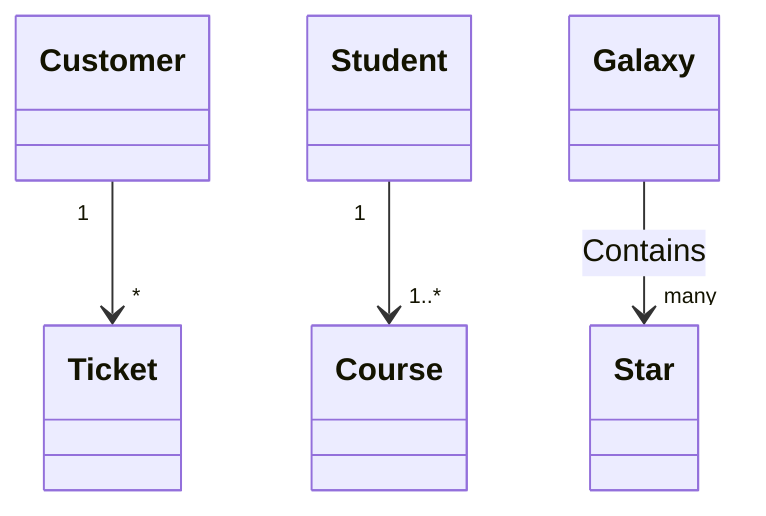


#### State Diagram

状态图是描述一个对象在其生存周期的动态行为，根据当前所处的状态对不同的事件做出反应。表现为一个对象所经历的状态序列，引起状态转换的事件（Event），因状态转换而伴随的动作（Action）

```
stateDiagram
[*] --> Still
Still --> Moving
Moving --> Still
Moving --> Crash
Crash --> [*]
Still --> [*]
```

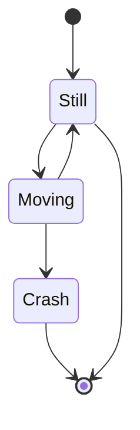

##### 分支 Forks

使用`<<fork>>`,`<<join>>`在状态图中指定分支，合并

```
stateDiagram
state fork_state <<fork>>
[*] --> fork_state
fork_state --> State2
fork_state --> State3

state join_state <<join>>
State2 --> join_state
State3 --> join_state
join_state --> State4
State4 --> [*]
```

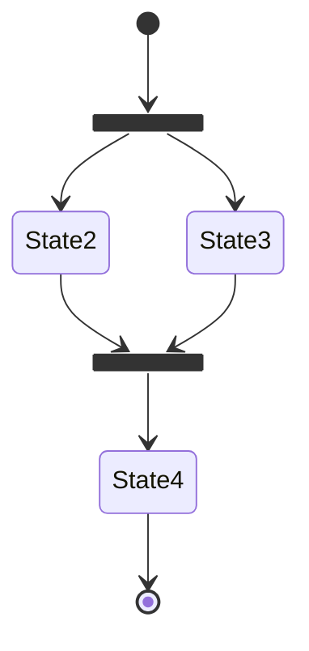


##### 复合状态 Composite

```
stateDiagram
[*] --> First
state First {
	[*] --> Second
    state Second {
        [*] --> sec
        sec --> Third
    	state Third {
    		[*] --> third
    		third --> [*]
    	}
    }   
}
```

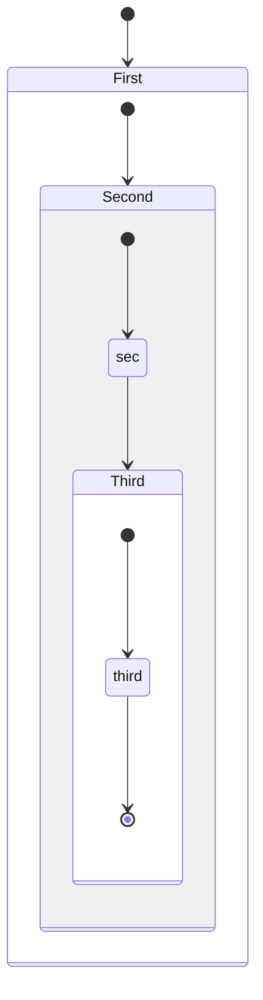

##### 并发状态  Concurrency

```

```

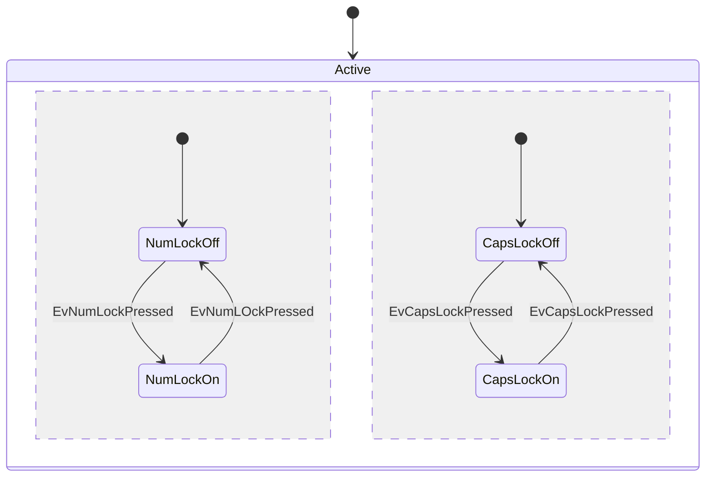

#### Grantt

甘特图将每个计划任务记录为一个从左到右延续的连续条。x轴代表时间，y轴记录不同的任务和它们完成的顺序。

```
gantt

       dateFormat                :YYYY-MM-DD
       title                     :Adding GANTT diagram functionality to mermaid
       excludes                  :excludes the named dates/days from being included in a charted task.. 
       (Accepts specific dates in YYYY-MM-DD format, days of the week ("sunday") or "weekends", but not the word "weekdays".) 
       section A section
       Completed task            :done,    des1, 2014-01-06,2014-01-08
       Active task               :active,  des2, 2014-01-09, 3d
       Future task               :         des3, after des2, 5d
       Future task2              :         des4, after des3, 5d

       section Critical tasks
       Completed task in the critical line :crit, done, 2014-01-06,24h
       Implement parser and jison          :crit, done, after des1, 2d
       Create tests for parser             :crit, active, 3d
       Future task in critical line        :crit, 5d
       Create tests for renderer           :2d
       Add to mermaid                      :1d

       section Documentation
       Describe gantt syntax               :active, a1, after des1, 3d
       Add gantt diagram to demo page      :after a1  , 20h
       Add another diagram to demo page    :doc1, after a1  , 48h

       section Last section
       Describe gantt syntax               :after doc1, 3d
       Add gantt diagram to demo page      :20h
       Add another diagram to demo page    :48h
```

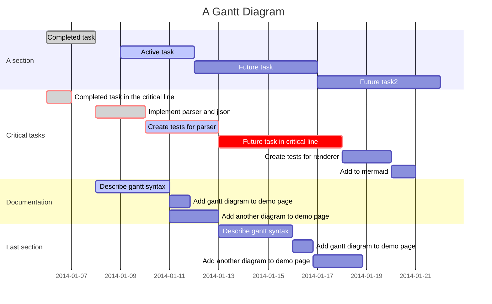


#### Pie Chart

```
pie
	title   key elements in Product X
	"Calcium(钙)" 	: 42.96
	"Potassium（钾）" : 50.05
	"Magnesium（镁）" : 10.01
	"Iron（铁）"      : 5
```

```mermaid
pie
	title   key elements in Product X
	"Calcium(钙)" 	: 42.96
	"Potassium（钾）" : 50.05
	"Magnesium（镁）" : 10.01
	"Iron（铁）"      : 5
```


